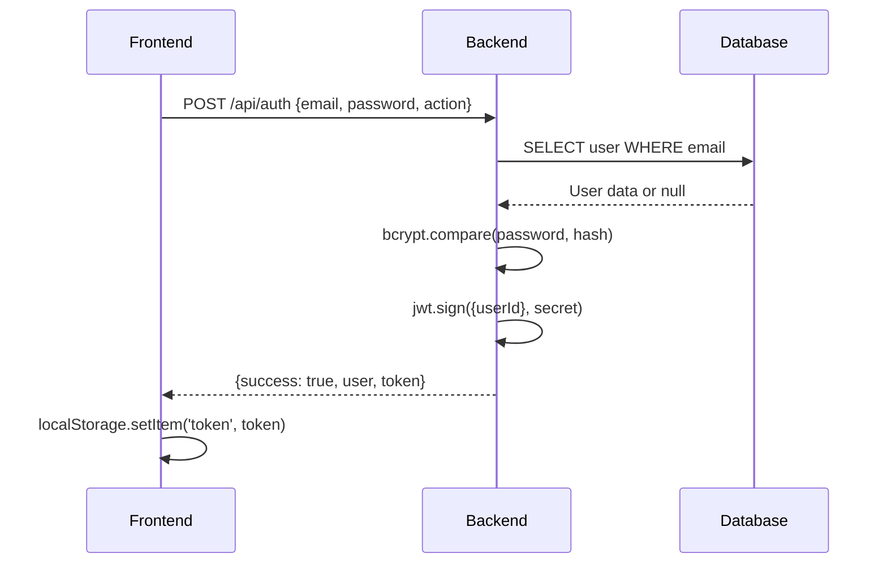
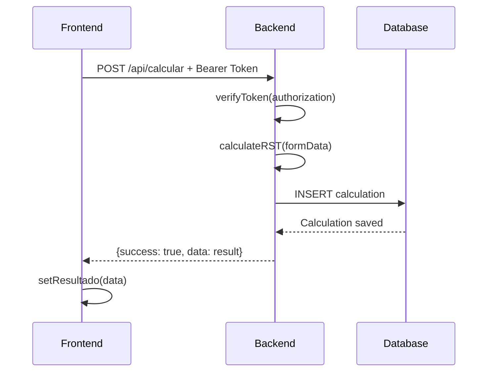

# 📋 Documentación Técnica - Simula tu Impuesto

## 🎯 Resumen Ejecutivo

**Simula tu Impuesto** es una aplicación web fullstack que permite calcular el Régimen Simple de Tributación (RST) colombiano. Desarrollada con una arquitectura moderna de monorepo, combina React en el frontend y Next.js en el backend para ofrecer tanto cálculos básicos como funcionalidades avanzadas con autenticación y persistencia de datos.

---

## 🏗️ Arquitectura General

```
┌─────────────────────────────────────────────────────────────┐
│                     MONOREPO STRUCTURE                      │
├─────────────────────────────────────────────────────────────┤
│  Frontend (React + Vite)    │    Backend (Next.js + API)    │
│  Puerto: 5174               │    Puerto: 3000               │
│                             │                               │
│  ┌─────────────────────┐    │    ┌─────────────────────┐    │
│  │   React Components  │◄───┼────┤   API Routes       │    │
│  │   - AuthModal       │    │    │   - /api/auth       │    │
│  │   - SimpleCalc      │    │    │   - /api/calcular   │    │
│  │   - AdvancedCalc    │    │    │   - /api/historial  │    │
│  │   - App.jsx         │    │    │   - /api/pdf        │    │
│  └─────────────────────┘    │    └─────────────────────┘    │
│                             │                               │
│  ┌─────────────────────┐    │    ┌─────────────────────┐    │
│  │   State Management  │    │    │   Database Layer    │    │
│  │   - useState        │    │    │   - Prisma ORM      │    │
│  │   - localStorage    │    │    │   - SQLite (dev)    │    │
│  └─────────────────────┘    │    │   - PostgreSQL(prod)│    │
│                             │    └─────────────────────┘    │
└─────────────────────────────────────────────────────────────┘
```

---

## 🎨 FRONTEND - Análisis Detallado

### 📦 Stack Tecnológico

| Tecnología | Versión | Propósito |
|------------|---------|-----------|
| **React** | 19.x | Librería de UI con hooks modernos |
| **Vite** | 7.x | Build tool ultra-rápido |
| **Tailwind CSS** | 3.x | Framework de estilos utilitarios |
| **Lucide React** | Latest | Iconografía SVG optimizada |
| **jsPDF** | Latest | Generación de PDFs client-side |
| **html2canvas** | Latest | Captura de elementos DOM |

### 🗂️ Estructura de Componentes

```
frontend/src/
├── components/
│   ├── AuthModal.jsx          # Autenticación y registro
│   ├── SimpleCalculator.jsx   # Calculadora básica (sin auth)
│   └── AdvancedCalculator.jsx # Calculadora avanzada (con auth)
├── App.jsx                    # Componente raíz y routing
├── main.jsx                   # Punto de entrada de React
└── index.css                  # Estilos globales + Tailwind
```

### 🔍 Componentes Principales

#### **1. App.jsx - Componente Raíz**
```javascript
// Responsabilidades principales:
const App = () => {
  // 🔐 Gestión de autenticación
  const [user, setUser] = useState(null);
  const [token, setToken] = useState(null);
  
  // 🎯 Control de modo de calculadora
  const [useAdvanced, setUseAdvanced] = useState(false);
  
  // 🔄 Persistencia en localStorage
  useEffect(() => {
    const savedToken = localStorage.getItem('token');
    const savedUser = localStorage.getItem('user');
    // Restaurar sesión automáticamente
  }, []);
  
  // 🎨 Renderizado condicional
  return (
    <div>
      {/* Header con estado de autenticación */}
      {/* Toggle entre calculadoras */}
      {useAdvanced ? <AdvancedCalculator /> : <SimpleCalculator />}
      {/* Modal de autenticación */}
    </div>
  );
};
```

**Características técnicas:**
- **State Management**: useState para estado local
- **Persistencia**: localStorage para JWT y datos de usuario
- **Routing Condicional**: Sin react-router, usa estado local
- **Responsive Design**: Tailwind CSS con breakpoints

#### **2. AuthModal.jsx - Autenticación**
```javascript
const AuthModal = ({ onClose, onLogin }) => {
  // 🔄 Dual mode: Login/Register
  const [isLogin, setIsLogin] = useState(true);
  
  // 📡 API Communication
  const handleSubmit = async (e) => {
    const response = await fetch(`${API_BASE_URL}/api/auth`, {
      method: 'POST',
      headers: { 'Content-Type': 'application/json' },
      body: JSON.stringify({
        action: isLogin ? 'login' : 'register',
        ...formData
      })
    });
    
    if (data.success) {
      // 💾 Guardar token y usuario
      localStorage.setItem('token', data.data.token);
      localStorage.setItem('user', JSON.stringify(data.data.user));
      onLogin(data.data.user, data.data.token);
    }
  };
};
```

**Flujo de autenticación:**
1. Usuario completa formulario
2. Validación client-side
3. Petición POST a `/api/auth`
4. Recepción de JWT token
5. Almacenamiento en localStorage
6. Actualización de estado global
7. Cierre de modal

#### **3. SimpleCalculator.jsx - Cálculo Básico**
```javascript
// 🧮 Cálculos locales (sin backend)
const SimpleCalculator = () => {
  // 📊 Tabla de tarifas RST hardcodeada
  const tarifasRST = {
    "venta_productos": {
      "1-3_años": 0.008,
      "4-6_años": 0.012,
      "7+_años": 0.016,
    }
    // ... más tipos de actividad
  };
  
  // ⚡ Cálculo instantáneo
  const calcularImpuestos = () => {
    const tarifa = tarifasRST[tipoActividad][tiempoActividad];
    const impuestoMensual = ingresosMensuales * tarifa;
    setResultado({
      impuestoMensual,
      impuestoAnual: impuestoMensual * 12,
      // ... más resultados
    });
  };
};
```

**Ventajas del cálculo local:**
- ⚡ **Velocidad**: Sin latencia de red
- 🔒 **Privacidad**: Los datos no salen del navegador
- 📱 **Offline**: Funciona sin conexión
- 🎯 **Simplicidad**: Ideal para consultas rápidas

#### **4. AdvancedCalculator.jsx - Cálculo Avanzado**
```javascript
const AdvancedCalculator = ({ user, token }) => {
  // 📋 Campos adicionales para cálculos complejos
  const [formData, setFormData] = useState({
    ventasMensuales: '',
    tipoActividad: 'venta_productos',
    tiempoActividad: '1-3_años',
    deducciones: '',           // 🆕 Campo avanzado
    ingresosBrutos: '',        // 🆕 Campo avanzado
    gastosDeducibles: ''       // 🆕 Campo avanzado
  });
  
  // 🔐 Cálculo autenticado en backend
  const calcularImpuestos = async () => {
    const response = await fetch(`${API_BASE_URL}/api/calcular`, {
      method: 'POST',
      headers: {
        'Content-Type': 'application/json',
        'Authorization': `Bearer ${token}`  // 🔑 JWT Auth
      },
      body: JSON.stringify(calculationData)
    });
  };
  
  // 📜 Historial de cálculos
  const obtenerHistorial = useCallback(async () => {
    const response = await fetch(`${API_BASE_URL}/api/historial`, {
      headers: { 'Authorization': `Bearer ${token}` }
    });
  }, [token]);
  
  // 📄 Generación de PDFs
  const descargarPDF = async () => {
    // 1. Solicitar HTML del backend
    const response = await fetch(`${API_BASE_URL}/api/pdf`, {
      method: 'POST',
      headers: {
        'Content-Type': 'application/json',
        'Authorization': `Bearer ${token}`
      },
      body: JSON.stringify({ calculationData: resultado })
    });
    
    // 2. Renderizar HTML en elemento temporal
    const tempDiv = document.createElement('div');
    tempDiv.innerHTML = data.data.htmlContent;
    document.body.appendChild(tempDiv);
    
    // 3. Capturar con html2canvas
    const canvas = await html2canvas(tempDiv, {
      scale: 2,
      useCORS: true,
      allowTaint: true
    });
    
    // 4. Generar PDF con jsPDF
    const pdf = new jsPDF('p', 'mm', 'a4');
    pdf.addImage(canvas.toDataURL('image/png'), 'PNG', 0, 0, width, height);
    pdf.save(filename);
  };
};
```

### 🎨 Sistema de Estilos

**Tailwind CSS Configuration:**
```javascript
// tailwind.config.js
module.exports = {
  content: ["./index.html", "./src/**/*.{js,ts,jsx,tsx}"],
  theme: {
    extend: {
      colors: {
        primary: {
          50: '#f0fdf4',
          600: '#16a34a',
          700: '#15803d'
        }
      }
    }
  }
}
```

**Patrones de diseño utilizados:**
- **Card Pattern**: `.card` para contenedores principales
- **Gradient Backgrounds**: `bg-gradient-to-br` para efectos visuales
- **Responsive Grid**: `grid md:grid-cols-3` para layouts adaptativos
- **State-based Styling**: Clases condicionales con template literals

### 🔗 Comunicación con Backend

**Configuración de Environment:**
```javascript
// Uso de variables de entorno Vite
const API_BASE_URL = import.meta.env.VITE_API_BASE_URL;
// .env: VITE_API_BASE_URL=http://localhost:3000
```

**Patrones de Fetch:**
```javascript
// Patrón estándar para todas las peticiones
const makeAuthenticatedRequest = async (endpoint, options = {}) => {
  const response = await fetch(`${API_BASE_URL}${endpoint}`, {
    headers: {
      'Content-Type': 'application/json',
      'Authorization': `Bearer ${token}`,
      ...options.headers
    },
    ...options
  });
  
  if (!response.ok) {
    throw new Error(`HTTP ${response.status}: ${response.statusText}`);
  }
  
  return response.json();
};
```

---

## ⚙️ BACKEND - Análisis Detallado

### 📦 Stack Tecnológico

| Tecnología | Versión | Propósito |
|------------|---------|-----------|
| **Next.js** | 15.x | Framework full-stack con API Routes |
| **TypeScript** | 5.x | Tipado estático para mayor robustez |
| **Prisma** | 5.x | ORM type-safe para base de datos |
| **SQLite** | 3.x | Base de datos de desarrollo |
| **PostgreSQL** | 14+ | Base de datos de producción |
| **bcryptjs** | 2.x | Hashing seguro de contraseñas |
| **jsonwebtoken** | 9.x | Generación y verificación de JWT |

### 🗂️ Estructura del Backend

```
backend/src/
├── app/api/                   # API Routes de Next.js
│   ├── auth/route.ts         # Autenticación (login/register)
│   ├── calcular/route.ts     # Cálculos avanzados
│   ├── historial/route.ts    # Historial de cálculos
│   └── pdf/route.ts          # Generación de reportes
├── lib/                      # Utilidades y configuraciones
│   ├── prisma.ts            # Cliente de base de datos
│   ├── auth.ts              # Funciones de autenticación
│   └── middleware.ts        # Middleware de autorización
└── prisma/
    └── schema.prisma        # Esquema de base de datos
```

### 🗄️ Modelo de Base de Datos

```prisma
// prisma/schema.prisma
model User {
  id        String   @id @default(cuid())
  email     String   @unique
  password  String   // Hash bcrypt
  name      String?
  createdAt DateTime @default(now())
  
  // Relación uno-a-muchos
  calculations Calculation[]
  
  @@map("users")
}

model Calculation {
  id                 String   @id @default(cuid())
  userId             String
  ventasMensuales    Float
  tipoActividad      String
  tiempoActividad    String
  porcentajeImpuesto Float
  impuestoMensual    Float
  impuestoAnual      Float
  
  // Campos avanzados (opcionales)
  deducciones        Float?
  ingresosBrutos     Float?
  gastosDeducibles   Float?
  baseGravable       Float?
  
  createdAt DateTime @default(now())
  
  // Relación con User
  user User @relation(fields: [userId], references: [id])
  
  @@map("calculations")
}
```

**Características del modelo:**
- **CUID**: Identificadores únicos y seguros
- **Índices**: Email único para usuarios
- **Relaciones**: Foreign key con CASCADE
- **Timestamps**: Tracking automático de creación
- **Campos opcionales**: Flexibilidad para cálculos básicos/avanzados

### 🔐 Sistema de Autenticación

#### **1. Hash de Contraseñas**
```typescript
// lib/auth.ts
import bcrypt from 'bcryptjs';

export const hashPassword = async (password: string): Promise<string> => {
  const saltRounds = 12; // Alto nivel de seguridad
  return await bcrypt.hash(password, saltRounds);
};

export const comparePassword = async (
  password: string, 
  hash: string
): Promise<boolean> => {
  return await bcrypt.compare(password, hash);
};
```

#### **2. JWT Token Management**
```typescript
import jwt from 'jsonwebtoken';

export const generateToken = (userId: string): string => {
  return jwt.sign(
    { userId },
    process.env.JWT_SECRET!,
    { 
      expiresIn: '7d',      // Token válido por 7 días
      algorithm: 'HS256'    // Algoritmo estándar
    }
  );
};

export const verifyToken = (token: string) => {
  try {
    return jwt.verify(token, process.env.JWT_SECRET!);
  } catch (error) {
    throw new Error('Token inválido');
  }
};
```

#### **3. Middleware de Autorización**
```typescript
// lib/middleware.ts
export const getAuthUser = (request: NextRequest) => {
  const authHeader = request.headers.get('Authorization');
  
  if (!authHeader?.startsWith('Bearer ')) {
    return null;
  }
  
  const token = authHeader.substring(7);
  
  try {
    const decoded = verifyToken(token);
    return decoded as { userId: string };
  } catch {
    return null;
  }
};
```

### 🚀 API Routes Detalladas

#### **1. /api/auth - Autenticación**
```typescript
export async function POST(request: NextRequest) {
  const { action, email, password, name } = await request.json();
  
  if (action === 'register') {
    // 1. Verificar si el usuario existe
    const existingUser = await prisma.user.findUnique({
      where: { email }
    });
    
    if (existingUser) {
      return NextResponse.json(
        { success: false, error: 'El usuario ya existe' },
        { status: 400 }
      );
    }
    
    // 2. Hash de la contraseña
    const hashedPassword = await hashPassword(password);
    
    // 3. Crear usuario en la base de datos
    const user = await prisma.user.create({
      data: {
        email,
        password: hashedPassword,
        name
      }
    });
    
    // 4. Generar JWT token
    const token = generateToken(user.id);
    
    // 5. Respuesta exitosa
    return NextResponse.json({
      success: true,
      data: {
        user: { id: user.id, email: user.email, name: user.name },
        token
      }
    });
    
  } else if (action === 'login') {
    // Proceso similar para login con validación de contraseña
  }
}
```

#### **2. /api/calcular - Cálculos Avanzados**
```typescript
export async function POST(request: NextRequest) {
  // 1. Autenticación (opcional para cálculos básicos)
  const authUser = getAuthUser(request);
  
  const {
    ventasMensuales,
    tipoActividad,
    tiempoActividad,
    deducciones = 0,
    ingresosBrutos = 0,
    gastosDeducibles = 0
  } = await request.json();
  
  // 2. Motor de cálculo RST
  const tarifasRST = {
    'venta_productos': {
      '1-3_años': 1.4,
      '4-6_años': 2.8,
      '7+_años': 4.2
    },
    // ... más tipos de actividad
  };
  
  // 3. Cálculo de base gravable
  const ingresosTotales = ingresosBrutos || ventasMensuales;
  const baseGravable = Math.max(0, ingresosTotales - gastosDeducibles - deducciones);
  
  // 4. Aplicación de tarifa RST
  const porcentajeImpuesto = tarifasRST[tipoActividad][tiempoActividad];
  const impuestoMensual = (baseGravable * porcentajeImpuesto) / 100;
  
  const resultado = {
    ventasMensuales,
    ventasAnuales: ventasMensuales * 12,
    baseGravable,
    porcentajeImpuesto,
    impuestoMensual,
    impuestoAnual: impuestoMensual * 12,
    deducciones,
    gastosDeducibles
  };
  
  // 5. Guardar en BD si el usuario está autenticado
  if (authUser) {
    await prisma.calculation.create({
      data: {
        userId: authUser.userId,
        ...resultado
      }
    });
  }
  
  return NextResponse.json({
    success: true,
    data: resultado
  });
}
```

#### **3. /api/historial - Gestión de Historial**
```typescript
export async function GET(request: NextRequest) {
  // 1. Verificar autenticación (requerida)
  const authUser = getAuthUser(request);
  
  if (!authUser) {
    return NextResponse.json(
      { success: false, error: 'No autorizado' },
      { status: 401 }
    );
  }
  
  // 2. Consultar cálculos del usuario
  const calculations = await prisma.calculation.findMany({
    where: { userId: authUser.userId },
    orderBy: { createdAt: 'desc' },
    take: 50 // Límite de 50 registros más recientes
  });
  
  return NextResponse.json({
    success: true,
    data: calculations
  });
}
```

#### **4. /api/pdf - Generación de Reportes**
```typescript
export async function POST(request: NextRequest) {
  const authUser = getAuthUser(request);
  
  if (!authUser) {
    return NextResponse.json(
      { success: false, error: 'No autorizado' },
      { status: 401 }
    );
  }
  
  const { calculationData } = await request.json();
  
  // Generar HTML estructurado para PDF
  const htmlContent = `
    <!DOCTYPE html>
    <html>
    <head>
      <style>
        body { font-family: Arial, sans-serif; }
        .header { background: #16a34a; color: white; padding: 20px; }
        .content { padding: 20px; }
        .result { font-size: 24px; font-weight: bold; color: #16a34a; }
      </style>
    </head>
    <body>
      <div class="header">
        <h1>🧮 Simula tu Impuesto - Reporte RST</h1>
      </div>
      <div class="content">
        <h2>Resultados del Cálculo</h2>
        <p class="result">Impuesto Mensual: ${formatCurrency(calculationData.impuestoMensual)}</p>
        <p>Tarifa aplicada: ${calculationData.porcentajeImpuesto}%</p>
        <p>Base gravable: ${formatCurrency(calculationData.baseGravable)}</p>
        <!-- Más detalles del cálculo -->
      </div>
    </body>
    </html>
  `;
  
  return NextResponse.json({
    success: true,
    data: {
      htmlContent,
      filename: `calculo-rst-${new Date().toISOString().split('T')[0]}.pdf`
    }
  });
}
```

### 🔒 Seguridad Implementada

1. **CORS Headers**: Configuración para permitir requests del frontend
2. **JWT Validation**: Verificación de tokens en rutas protegidas
3. **Password Hashing**: bcrypt con salt rounds altos
4. **Input Validation**: Validación de tipos y rangos
5. **Error Handling**: Manejo seguro sin exponer información sensible

---

## 🔗 CONEXIÓN FRONTEND-BACKEND

### 📡 Protocolos de Comunicación

#### **1. Autenticación Flow**


#### **2. Cálculo Avanzado Flow**


### 🔄 Estado y Sincronización

#### **Estado del Frontend:**
```javascript
// Flujo de estados en App.jsx
const [user, setUser] = useState(null);        // Usuario autenticado
const [token, setToken] = useState(null);      // JWT token
const [useAdvanced, setUseAdvanced] = useState(false); // Modo de calculadora

// Persistencia automática
useEffect(() => {
  const savedToken = localStorage.getItem('token');
  const savedUser = localStorage.getItem('user');
  
  if (savedToken && savedUser) {
    setToken(savedToken);
    setUser(JSON.parse(savedUser));
  }
}, []);
```

#### **Sincronización de Datos:**
```javascript
// Patrón de sincronización usado en AdvancedCalculator
useEffect(() => {
  if (token) {
    obtenerHistorial(); // Cargar historial automáticamente
  }
}, [token, obtenerHistorial]);

// Invalidación automática tras nuevos cálculos
const calcularImpuestos = async () => {
  // ... cálculo
  if (data.success) {
    setResultado(data.data);
    obtenerHistorial(); // Refrescar historial
  }
};
```

### 🌐 Configuración de Environment

#### **Variables de Entorno:**
```bash
# Frontend (.env)
VITE_API_BASE_URL=http://localhost:3000

# Backend (.env)
DATABASE_URL="file:./dev.db"
JWT_SECRET="secret_super_seguro_para_desarrollo"
```

#### **Configuración de CORS:**
```javascript
// backend/next.config.js
const nextConfig = {
  async headers() {
    return [
      {
        source: "/api/:path*",
        headers: [
          { key: "Access-Control-Allow-Credentials", value: "true" },
          { key: "Access-Control-Allow-Origin", value: "*" },
          { key: "Access-Control-Allow-Methods", value: "GET,OPTIONS,PATCH,DELETE,POST,PUT" },
          { key: "Access-Control-Allow-Headers", value: "X-CSRF-Token, X-Requested-With, Accept, Accept-Version, Content-Length, Content-MD5, Content-Type, Date, X-Api-Version, Authorization" },
        ]
      }
    ]
  }
};
```

---

## 🚀 CARACTERÍSTICAS AVANZADAS

### 📊 Sistema de Cálculo Dual

#### **Cálculo Básico (Frontend)**
- **Velocidad**: Resultados instantáneos
- **Privacidad**: Sin envío de datos
- **Offline**: Funciona sin conexión
- **Limitaciones**: Solo cálculos simples

#### **Cálculo Avanzado (Backend)**
- **Precisión**: Considera deducciones y gastos
- **Persistencia**: Guarda en base de datos
- **Historial**: Tracking completo
- **PDFs**: Generación de reportes

### 📄 Generación de PDFs

#### **Proceso Híbrido:**
1. **Backend**: Genera HTML estructurado
2. **Frontend**: Renderiza HTML en DOM temporal
3. **html2canvas**: Captura como imagen
4. **jsPDF**: Convierte a documento PDF
5. **Download**: Descarga automática

#### **Ventajas de este enfoque:**
- **Flexibilidad**: HTML/CSS para diseño
- **Performance**: No requiere headless browser en servidor
- **Customización**: Control total del layout
- **Compatibilidad**: Funciona en todos los navegadores

### 🔐 Seguridad Multi-Capa

#### **Frontend:**
- Validación de formularios
- Sanitización de inputs
- Manejo seguro de tokens
- HTTPS only en producción

#### **Backend:**
- Hash de contraseñas con bcrypt
- JWT con expiración
- Validación de tipos TypeScript
- Rate limiting (futuro)

#### **Base de Datos:**
- Constraints y validaciones
- Índices únicos
- Relaciones con CASCADE
- Backup automático (producción)

---

## 📈 MÉTRICAS Y RENDIMIENTO

### ⚡ Performance Frontend

#### **Bundle Size Optimization:**
```javascript
// vite.config.js - Code splitting
export default defineConfig({
  build: {
    rollupOptions: {
      output: {
        manualChunks: {
          vendor: ['react', 'react-dom'],
          ui: ['lucide-react'],
          pdf: ['jspdf', 'html2canvas']
        }
      }
    }
  }
});
```

#### **Lazy Loading:**
```javascript
// Componentes cargados dinámicamente
const AdvancedCalculator = lazy(() => import('./components/AdvancedCalculator'));

// Suspense boundary
<Suspense fallback={<div>Cargando...</div>}>
  <AdvancedCalculator />
</Suspense>
```

### 🗄️ Performance Backend

#### **Database Optimization:**
```prisma
// Índices para consultas frecuentes
model User {
  email String @unique // Índice automático
  @@index([createdAt]) // Índice manual
}

model Calculation {
  userId String
  createdAt DateTime @default(now())
  @@index([userId, createdAt]) // Índice compuesto
}
```

#### **Query Optimization:**
```typescript
// Consultas eficientes con Prisma
const calculations = await prisma.calculation.findMany({
  where: { userId: authUser.userId },
  select: {
    id: true,
    impuestoMensual: true,
    tipoActividad: true,
    createdAt: true
    // Solo campos necesarios
  },
  orderBy: { createdAt: 'desc' },
  take: 50 // Límite de resultados
});
```

---

## 🔄 FLUJOS DE DESARROLLO

### 🛠️ Scripts de Desarrollo

```json
{
  "scripts": {
    "dev": "concurrently \"npm run dev:frontend\" \"npm run dev:backend\"",
    "dev:frontend": "cd frontend && npm run dev",
    "dev:backend": "cd backend && npm run dev",
    "build": "npm run build:frontend && npm run build:backend",
    "build:frontend": "cd frontend && npm run build",
    "build:backend": "cd backend && npm run build"
  }
}
```

### 🚀 Proceso de Despliegue

#### **Development:**
1. `npm install` - Instalar dependencias
2. `npx prisma generate` - Generar cliente Prisma
3. `npx prisma db push` - Sincronizar esquema
4. `npm run dev` - Iniciar servidores

#### **Production (Vercel):**
1. **Frontend**: Build automático con Vite
2. **Backend**: Deployment como Serverless Functions
3. **Database**: PostgreSQL en Vercel Postgres
4. **Environment**: Variables seguras en dashboard

---

## 🎯 CASOS DE USO PRINCIPALES

### 👨‍💼 Emprendedor Casual
1. Accede sin registro
2. Usa calculadora básica
3. Obtiene estimación rápida
4. Entiende beneficios del RST

### 👩‍💼 Empresario Formal
1. Se registra en la plataforma
2. Usa calculadora avanzada
3. Incluye deducciones y gastos
4. Descarga reportes en PDF
5. Consulta historial de cálculos

### 🧮 Contador Profesional
1. Gestiona múltiples clientes
2. Genera reportes profesionales
3. Mantiene historial detallado
4. Usa datos para asesorías

---

## 🔮 ROADMAP FUTURO

### 🎯 Corto Plazo (1-2 meses)
- [ ] Dashboard de administración
- [ ] Exportar historial a Excel
- [ ] Notificaciones por email
- [ ] API rate limiting

### 🚀 Mediano Plazo (3-6 meses)
- [ ] Múltiples idiomas (i18n)
- [ ] Tema oscuro
- [ ] PWA (Progressive Web App)
- [ ] Integración con APIs de DIAN

### 🌟 Largo Plazo (6+ meses)
- [ ] Calculadora para otros regímenes
- [ ] Comparación entre regímenes
- [ ] Sistema de alertas fiscales
- [ ] Mobile app nativa

---

## 📚 RECURSOS TÉCNICOS

### 📖 Documentación
- [React 19 Docs](https://react.dev/)
- [Next.js 15 App Router](https://nextjs.org/docs)
- [Prisma ORM Guide](https://www.prisma.io/docs)
- [Tailwind CSS](https://tailwindcss.com/docs)

### 🛠️ Herramientas de Desarrollo
- **IDE**: VS Code con extensiones React/TypeScript
- **Database**: Prisma Studio para visualización
- **API Testing**: Thunder Client o Postman
- **Version Control**: Git con GitHub

### 🔍 Debugging y Monitoreo
- **Frontend**: React DevTools, Vite HMR
- **Backend**: Next.js built-in debugging
- **Database**: Prisma query logging
- **Production**: Vercel Analytics

---

## ✅ CONCLUSIONES TÉCNICAS

### 🎯 Fortalezas de la Arquitectura
1. **Monorepo**: Simplifica desarrollo y deployment
2. **TypeScript**: Reduce bugs y mejora DX
3. **Prisma**: Type-safe database access
4. **Modern Stack**: React 19 + Next.js 15
5. **Responsive**: Funciona en todos los dispositivos

### 🚀 Innovaciones Implementadas
1. **Dual Calculator**: Básica (local) + Avanzada (servidor)
2. **Hybrid PDF**: Backend HTML + Frontend rendering
3. **Smart Auth**: JWT con localStorage persistence
4. **Environment Variables**: Configuración flexible
5. **CORS Handling**: Cross-origin requests seguros

### 📊 Impacto del Proyecto
- **Educativo**: Democratiza conocimiento fiscal
- **Práctico**: Herramienta real para emprendedores
- **Técnico**: Demostración de arquitectura moderna
- **Escalable**: Base para funcionalidades futuras

---

*Documentación técnica generada para la exposición del proyecto **Simula tu Impuesto***  
*Autor: Daniel Leal | Fecha: Septiembre 2025*